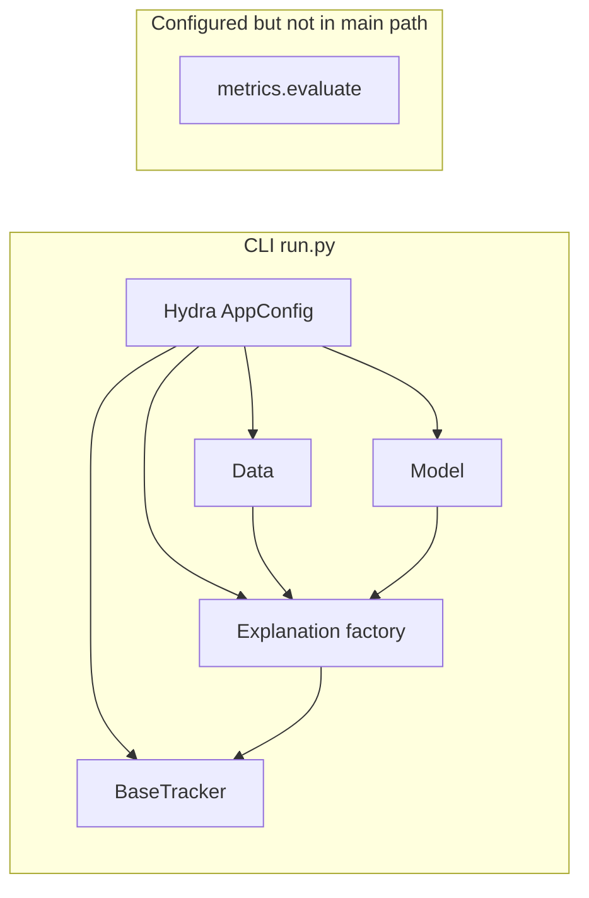

# RAITAP codebase architecture audit

## Overall assessment (rating)

**Grade: B (solid prototype / thesis codebase, not yet a cohesive product pipeline).**

**Strengths**

- **Clear vertical slices**: `[src/raitap/data](src/raitap/data)`, `[models](src/raitap/models)`, `[metrics](src/raitap/metrics)`, `[transparency](src/raitap/transparency)`, `[tracking](src/raitap/tracking)` with Hydra config under `[src/raitap/configs](src/raitap/configs)`.
- **Sensible abstractions**: `BaseExplainer` + `ExplanationResult`, `MetricComputer` protocol, `BaseTracker` + MLflow implementation.
- **Optional heavy deps** via extras (`captum`, `shap`, `mlflow`, `metrics`) in `[pyproject.toml](pyproject.toml)`.
- **Tests are substantial** for transparency factories, explainers, visualisers, metrics, data loaders, and model loading; Ruff + Pyright configured.

**Weaknesses**

- **Main entrypoint does not implement the full config surface** (metrics default is loaded but never used; see flaw **F-001**, **F-023**).
- **A few real bugs** in metadata/logging and tests that encode wrong expectations (**F-002**).
- **Patterns that fight Python / typing** (`Explanation` as a class with `__new__` returning a different type — **F-004**).

---

## Flaws by severity (numbered ID)

### Critical

| ID        | Issue                                                                                                                                                                                                                                                                                                                          | Location / notes                              |
| --------- | ------------------------------------------------------------------------------------------------------------------------------------------------------------------------------------------------------------------------------------------------------------------------------------------------------------------------------ | --------------------------------------------- |
| **F-001** | **Metrics subsystem is not wired into `[run.py](src/raitap/run.py)`** despite `[config.yaml](src/raitap/configs/config.yaml)` default `metrics: classification`. Users get no performance metrics from the primary command.                                                                                                    | Architectural / product gap.                  |
| **F-023** | **Even if you called `evaluate()`, the current pipeline does not provide ground-truth labels.** `Data` loads tensors only; `run.py` computes `predicted_classes` but never loads targets. Classification/detection metrics need a designed data + config contract (e.g. label column(s), sidecar file, or separate task mode). | Blocks honest integration without new design. |

### High

| ID        | Issue                                                                                                                                                                                                                                                                                                                                                | Location / notes                                                    |
| --------- | ---------------------------------------------------------------------------------------------------------------------------------------------------------------------------------------------------------------------------------------------------------------------------------------------------------------------------------------------------- | ------------------------------------------------------------------- |
| **F-002** | `**Data.describe()` never uses `cfg.data.name`.** It uses `getattr(self, "name", "dataset")`, but `Data.__init__` only sets `source`. Dataset name in MLflow / metadata is wrong. `[test_data_class.py](src/raitap/data/tests/test_data_class.py)` passes `name="test_dataset"` but asserts `info["name"] == "dataset"`, which **locks in the bug**. | `[data.py](src/raitap/data/data.py)` `describe()`.                  |
| **F-003** | `**MLFlowTracker._config_params` assumes `transparency` is a flat mapping with `algorithm`.** With multi-explainer configs (e.g. `[demo.yaml](src/raitap/configs/transparency/demo.yaml)`), `config_dict.get("transparency", {}).get("algorithm", "")` is empty — logged params are misleading/incomplete.                                           | `[mlflow_tracker.py](src/raitap/tracking/mlflow/mlflow_tracker.py)` |

### Medium

| ID        | Issue                                                                                                                                                                                                                                     | Location / notes                                                                                      |
| --------- | ----------------------------------------------------------------------------------------------------------------------------------------------------------------------------------------------------------------------------------------- | ----------------------------------------------------------------------------------------------------- |
| **F-004** | `**Explanation` is a class whose `__new__` returns `ExplanationResult`.** Surprising for readers (especially from TS/Java/C#), hurts static analysis, and is unpythonic; a module-level function `run_explanation(...)` would be clearer. | `[transparency/factory.py](src/raitap/transparency/factory.py)`                                       |
| **F-005** | `**create_visualisers` runs twice per explainer** (once inside `Explanation.__new__` for compatibility check, again in `run.py` for rendering). Wasteful; risky if visualisers ever become stateful.                                      | `[factory.py](src/raitap/transparency/factory.py)`, `[run.py](src/raitap/run.py)`                     |
| **F-006** | `**TrackingConfig` dataclass omits `_target_` while YAML supplies it.** Schema and runtime shape diverge; `run.py` relies on `hasattr(config.tracking, "_target_")`.                                                                      | `[schema.py](src/raitap/configs/schema.py)`, `[mlflow.yaml](src/raitap/configs/tracking/mlflow.yaml)` |
| **F-007** | `**cfg_to_dict` last branch `dict[Any, Any](cfg)`** is an unusual way to copy/construction; non-mapping iterables behave poorly vs `dict(cfg)`.                                                                                           | `[factory_utils.py](src/raitap/configs/factory_utils.py)`                                             |

### Low

| ID        | Issue                                                                                                                                                                                                                             | Location / notes                                                                                                       |
| --------- | --------------------------------------------------------------------------------------------------------------------------------------------------------------------------------------------------------------------------------- | ---------------------------------------------------------------------------------------------------------------------- |
| **F-008** | **Duplicated download helper** (`_download_file` / URL fetch pattern) in `[data.py](src/raitap/data/data.py)` and `[samples.py](src/raitap/data/samples.py)`.                                                                     | DRY                                                                                                                    |
| **F-009** | **Near-duplicate JSON-serialisation helpers** (`_json_serialisable` in metrics factory vs `_serialisable` in transparency results).                                                                                               | `[metrics/factory.py](src/raitap/metrics/factory.py)`, `[transparency/results.py](src/raitap/transparency/results.py)` |
| **F-010** | **Duplicated tests** for `tensor_to_python` in `[test_classification_metrics.py](src/raitap/metrics/tests/test_classification_metrics.py)` and `[test_detection_metrics.py](src/raitap/metrics/tests/test_detection_metrics.py)`. | Test maintenance                                                                                                       |
| **F-011** | **Redundant inner `import torch`** in `run_explanations`.                                                                                                                                                                         | `[run.py](src/raitap/run.py)`                                                                                          |
| **F-012** | **Stale TODO** on visualiser line.                                                                                                                                                                                                | `[run.py](src/raitap/run.py)` ~L79                                                                                     |
| **F-013** | **Commented-out `registered_model_name`** in `log_model` — dead / unfinished registry path.                                                                                                                                       | `[mlflow_tracker.py](src/raitap/tracking/mlflow/mlflow_tracker.py)`                                                    |
| **F-014** | `**requires-python = ">=3.13"` vs PyPI classifiers** listing 3.10–3.12 — metadata inconsistency.                                                                                                                                  | `[pyproject.toml](pyproject.toml)`                                                                                     |
| **F-015** | **Stale docstring** referencing `load_data` in `[samples.py](src/raitap/data/samples.py)`.                                                                                                                                        | Docs accuracy                                                                                                          |
| **F-016** | `**tuple[int, ...](dims)`** in a print — valid in 3.9+ but reads oddly; `tuple(dims)` is clearer.                                                                                                                                 | `[run.py](src/raitap/run.py)`                                                                                          |
| **F-017** | **Heavy use of `print`** instead of `logging` — harder to test and to silence in libraries.                                                                                                                                       | Multiple modules                                                                                                       |
| **F-018** | **Broad `except Exception` + re-raise** in Hydra `instantiate` paths — user-friendly but can hide root causes without logging.                                                                                                    | Factories                                                                                                              |
| **F-019** | **SHAP `background_data` defaults to `inputs`** with a print warning — easy to miss in batch/CI runs; quality implications.                                                                                                       | `[shap_explainer.py](src/raitap/transparency/explainers/shap_explainer.py)`                                            |
| **F-020** | **No automated test** that exercises `@hydra.main` / full `main` with composed defaults (only lower-level and smoke scripts).                                                                                                     | Integration gap                                                                                                        |
| **F-021** | `**[methods_registry.py](src/raitap/transparency/methods_registry.py)` name suggests a registry; file only defines one exception type.** Naming / organisation.                                                                   | Nit                                                                                                                    |
| **F-022** | **Wheel packaging** excludes `test_*.py` but not `conftest.py` — pytest helpers could ship in the wheel (minor).                                                                                                                  | `[pyproject.toml](pyproject.toml)` `[tool.hatch.build.targets.wheel]`                                                  |

### Dead / fringe code (not necessarily removable)

| ID        | Issue                                                                                                                                                                                                                                                                                                              |
| --------- | ------------------------------------------------------------------------------------------------------------------------------------------------------------------------------------------------------------------------------------------------------------------------------------------------------------------ |
| **F-024** | `**[smoke_test_mlflow.py](src/raitap/tracking/tests/smoke_test_mlflow.py)`** is a CLI script under `tests/` with `sys.path` manipulation — useful for manual QA, unusual layout (consider `scripts/` + minimal test as now in `[test_smoke_test_mlflow.py](src/raitap/tracking/tests/test_smoke_test_mlflow.py)`). |

**Note:** Optional visualisers/explainers are not dead code; they are exercised by tests and configs.

---

## Pythonic notes (for a TS/Java/C# background)

- **Protocols and ABCs** (e.g. `MetricComputer`, `BaseTracker`) map well to interfaces; **dataclasses** replace many DTO patterns.
- **Avoid “factory as class with `__new__`”** — prefer functions or explicit builder types (**F-004**).
- **Hydra `instantiate`** is similar to dependency-injection containers; keep `_target_` strings and Python schema types in sync (**F-006**).

---

## Testing summary

- **Good coverage** of transparency, metrics computers, data tensor loading, model paths, MLflow smoke argparse default.
- **Gaps:** no end-to-end test of `raitap` CLI / Hydra-composed `main` (**F-020**); `**Data.describe` test asserts incorrect name** (**F-002**).

---

## Suggested refactor order (after you approve execution)

1. Fix **F-002** (and correct the test to expect `cfg.data.name`).
2. Decide product intent for **F-001 / F-023** (explanation-only vs labeled evaluation); then either wire metrics + labels or remove metrics from default config / document opt-in.
3. Fix **F-003** for multi-explainer configs (e.g. log explainer keys and algorithms).
4. Replace `Explanation` class pattern (**F-004**) and dedupe visualiser creation (**F-005**).
5. Align `TrackingConfig` with YAML (**F-006**); consolidate serialisation/helpers (**F-008**, **F-009**).
6. Tidy low-severity items (logging, pyproject classifiers, hatch excludes, comments).

