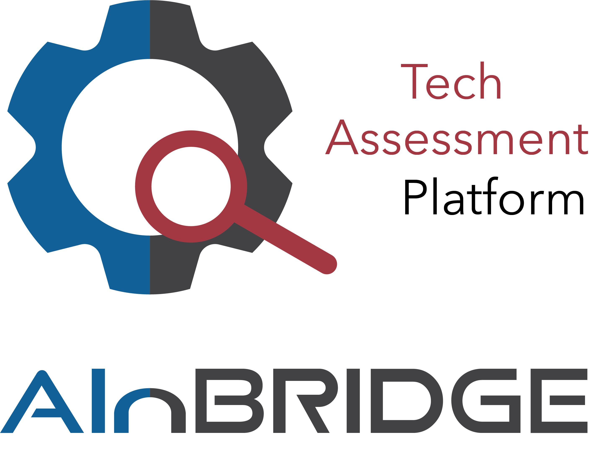

## Purpose
The certainty pipeline is dedicated to the certification of responsible AI.
Four dimensions can be certified following MLOps practices.

The four dimensions are:
* Transparency
* Reliability
* Safety and security
* Autonomy and control

## Development Milestones
February 2023	CertAInty project is launched.  
August 2023		First documentation is created.  
January 2024	DGX Cluster migrated to new hardware.  
August 2024		DGX Cluster migrated to new software.  

### Overview over Cluster Migration Update (Summer 2024)
| Functionality         | Pre 2024          | Current Version   |
| --------              | --------          | ---               |
| Data Access   	      | Insecure Access	  | Secure Access     |
| Cluster Access    	  | SSH       	      | SSH               |
| Autostart	            | Docker	          | Podman            |
| CI/CD	                | GitHub            | GitHub            |
| Job Scheduling	      | AirFlow           | AirFlow           |
| Artifact Gathering	  | MLFlow	          | MLFlow            |
| Dataset Management	  | Oxen              | Oxen              |
| Job resubmit          | No resubmit	      | Every sunday      |

## Design Decisions
### Key Characteristics
* Easily extendable
* Easily maintainable

**Non-personal Maintenance Account.** By having an extra account that is bound to Ricardo rather than the personal account of the developer, there are no problems with joint maintenance by several developers and by leaving staff.

**ONNX Standard.** This standard is framework-independent, working well for tensorflow and pytorch. With few adjustments to the code this standard should be attainable for every use case. Versioning is easy too.

**Hydra instead of AirFlow.** Use of Hydra keeps all programming in python language. This library is more flexible, faster, and more resource-efficient. Containers are no longer required and config files make the jobs readable and structured. While there is some initial workload to get up to speed with Hydra, there is less work during operation and further development of the tech assessment platform.

**Oxen on wait.** Dataset versioning is not as important as other aspects of the tech assessment platform. Therefore it can be integrated at a later time. This corresponds to a minimal viable product approach.

## MVP Definition
### High Priority
* GradCam, Shap and Anchor Scripts
* Execution with Hydra Config Files
* Tracking with MLFlow
* Evaluation on Dermatology and Autonomous Vehicles Datasets
* Evaluation of EfficientNet and YOLO
* Installable With a Single Package
* Automatic Updates and Scheduled Start-Ups

### Medium Priority
* Dashboard
* Other Scripts
* Extension to New Models
* Extension to new Datasets

## Datasets
### Udacity Self Driving Car Dataset
The dataset contains 97,942 labels across 11 classes and 15,000 images. There are 1,720 null examples (images with no labels).

All images are 1920x1200 (download size ~3.1 GB). We have also provided a version downsampled to 512x512 (download size ~580 MB) that is suitable for most common machine learning models (including YOLO v3, Mask R-CNN, SSD, and mobilenet).

Annotations have been hand-checked for accuracy by Roboflow.

Download: https://public.roboflow.com/object-detection/self-driving-car

### Dermatology Dataset
The data sets behind the work on PlasmoCount (first described in the preprint of our paper on MedRxiv - https://doi.org/10.1101/2021.01.26.21250284). More information about the data sets or model can be gained from contacting the Baum laboratory.

Download: https://data.mendeley.com/datasets/j55fyhtxn4/2