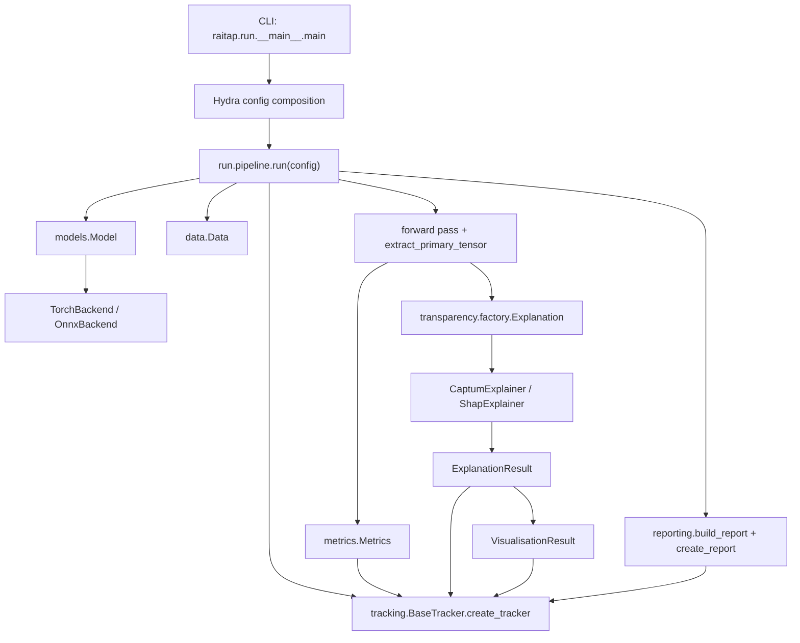

RAITAP is organized as a thin orchestration layer over specialized modules. The top-level control path starts in `src/raitap/run/__main__.py`, delegates to `src/raitap/run/pipeline.py`, and then composes modules from `models`, `data`, `transparency`, `metrics`, `tracking`, and `reporting`.

## Module Relationships

`src/raitap/run/pipeline.py` is intentionally the only place that knows about the full end-to-end lifecycle. It constructs `Model(config)` and `Data(config)`, performs a forward pass, then computes optional metrics and transparency results before handing artifacts to reporting and tracking.

`src/raitap/models/model.py` isolates model acquisition. It chooses between built-in torchvision models, Torch checkpoints, TorchScript archives, and ONNX files, then wraps the resolved runtime in a `TorchBackend` or `OnnxBackend` from `src/raitap/models/backend.py`.

`src/raitap/data/data.py` isolates data acquisition and label alignment. It accepts named samples, local paths, and URLs, then normalizes images to NCHW tensors or tabular inputs to `(N, F)` tensors. Label logic stays in the same module so the pipeline can treat `data.labels` as a single optional tensor.

`src/raitap/transparency/factory.py` is the internal seam between config and explainability frameworks. It validates the explainer config shape, resolves `_target_` values against the `raitap.transparency.` prefix, instantiates explainers and visualisers with Hydra, expands `call.*.source` references into tensors, and returns an `ExplanationResult`.

## Key Design Decisions

### Hydra is the control plane

The config dataclasses in `src/raitap/configs/schema.py` are small and stable, but most behavior is controlled by Hydra groups under `src/raitap/configs/`. This lets the CLI switch model presets, datasets, explainers, tracking backends, and reporting styles without changing application code. The helper `resolve_target()` in `src/raitap/configs/utils.py` also means user configs can use short `_target_` names such as `CaptumExplainer` instead of full import paths.

### Runtime backends are abstracted behind one model interface

`Model.backend` is always a `ModelBackend`, whether the original asset is PyTorch or ONNX. That is why `run.pipeline._forward_primary_tensor()` can call `backend._prepare_inputs()` and `backend(...)` without branching on file format, and why explainers receive `backend.as_model_for_explanation()` rather than the raw backend object.

### Explanation semantics are explicit, not inferred later

`AttributionOnlyExplainer.explain()` in `src/raitap/transparency/explainers/base_explainer.py` builds an `ExplanationSemantics` object before writing artifacts. That avoids a common failure mode where visualisers and reports guess whether a tensor represents image pixels, feature columns, or token positions after the fact. The semantic helpers in `src/raitap/transparency/semantics.py` and contracts in `src/raitap/transparency/contracts.py` are the reason visualiser compatibility can be validated early.

### Artifacts are first-class outputs

Most modules write structured outputs under the current Hydra run directory. Metrics persist JSON and figures in `metrics/`. Transparency persists `attributions.pt`, visualisations, and metadata under `transparency/<explainer>/`. Reporting stages those outputs into `reports/`. Tracking then uploads those same directories instead of recomputing anything. This design keeps local and tracked runs aligned.

## Request and Data Lifecycle

1. `raitap.run.__main__.main()` prepares Hydra CLI arguments and composes the config from `src/raitap/configs/`.
2. `run.pipeline.run()` constructs the `Model` and `Data` objects.
3. The pipeline performs a forward pass and normalizes the primary model tensor through `extract_primary_tensor()` in `src/raitap/run/forward_output.py`.
4. If metrics are enabled, `metrics.Metrics` instantiates the configured metric computer, updates it, writes `metrics.json`, and renders charts.
5. For every configured transparency entry, `transparency.factory.Explanation` instantiates the explainer and visualisers, computes attributions, writes artifacts, and renders figures.
6. If reporting is enabled, `reporting.build_report()` selects metrics and visualisation assets and `PDFReporter.generate()` writes the final PDF.
7. If tracking is enabled, `BaseTracker.create_tracker()` resolves the tracker and each artifact-owning object logs itself.

The result is a pipeline that treats explainability, metrics, and reporting as peer stages rather than optional side scripts. That is the main architectural point: RAITAP is not just an explainer wrapper, it is an assessment runner.
