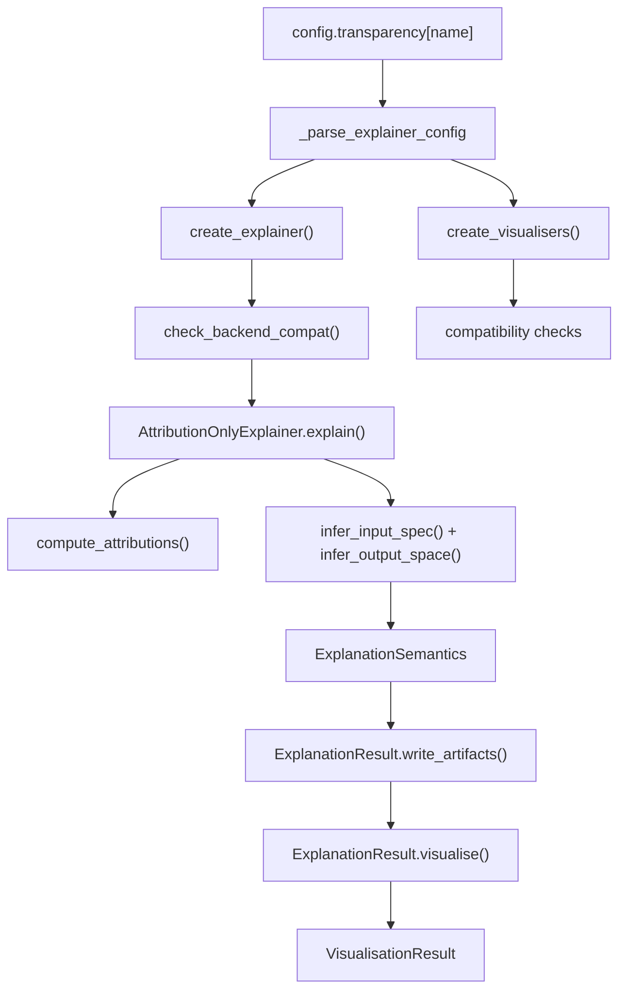

The transparency module is the most opinionated part of RAITAP. It does not only call Captum or SHAP; it standardizes how explainers are created, how batching works, how visualisers are attached, and how the meaning of an explanation is recorded.

## What This Concept Is

At the center of the module is the `Explanation` factory in `src/raitap/transparency/factory.py`. It takes one explainer entry from `config.transparency`, instantiates the explainer and its visualisers, computes the explanation, and returns an `ExplanationResult`.

That result is not just a tensor. It carries an `ExplanationSemantics` value from `src/raitap/transparency/contracts.py`, which records:

- payload kind
- explanation scope
- method families
- sample selection
- input metadata
- output-space metadata

This concept exists so downstream code can validate and place artifacts without guessing. It relates to `/docs/model-and-data`, because input metadata comes from the data layer, and it relates to `/docs/outputs-tracking-and-reporting`, because the resulting semantics determine report sections and tracker artifacts.

## How It Works Internally

The implementation follows a layered pattern:



`src/raitap/transparency/explainers/base_explainer.py` defines the shared lifecycle. `AttributionOnlyExplainer.explain()` handles batching, memory cleanup, semantic inference, and artifact writing. Concrete explainers only implement `compute_attributions(...)`.

`CaptumExplainer` in `src/raitap/transparency/explainers/captum_explainer.py` dynamically resolves a method from `captum.attr`. `ShapExplainer` in `src/raitap/transparency/explainers/shap_explainer.py` dynamically resolves a class from `shap` and contains special logic for required background data and ONNX-safe `KernelExplainer` execution.

Semantic inference happens after attributions are computed. `infer_input_spec()` and `infer_output_space()` in `src/raitap/transparency/semantics.py` use explicit input metadata plus algorithm family information to decide whether a tensor represents image features, tabular features, token sequences, or layer activations. Visualisers then declare compatibility through class variables such as `supported_output_spaces` and `supported_method_families`.

## Basic Usage

A config-driven Captum run is the main path:

```yaml
transparency:
  captum_ig:
    _target_: CaptumExplainer
    algorithm: IntegratedGradients
    call:
      target: 0
    visualisers:
      - _target_: CaptumImageVisualiser
```

That entry is consumed by `Explanation(config, "captum_ig", model, inputs, ...)`, which eventually calls `CaptumExplainer.compute_attributions(...)`.

## Advanced Usage

SHAP explainers often need background data and outer batching. RAITAP treats background datasets as declarative sources inside `call:`.

```yaml
transparency:
  shap_gradient:
    _target_: ShapExplainer
    algorithm: GradientExplainer
    call:
      target: 0
      nsamples: 10
      background_data:
        source: imagenet_samples
        n_samples: 2
    raitap:
      batch_size: 1
      progress_desc: "SHAP batches"
      input_metadata:
        kind: image
        layout: NCHW
    visualisers:
      - _target_: ShapImageVisualiser
```

At runtime, `_resolve_call_data_sources()` in `src/raitap/transparency/factory.py` loads `background_data` into a tensor before the explainer sees it.

<Callout type="warn">Do not rely on tensor shape alone for semantic inference when you call explainers directly. `infer_output_space()` in `src/raitap/transparency/semantics.py` raises if it cannot distinguish image, tabular, text, or time-series semantics from explicit metadata. The full RAITAP pipeline auto-fills this from `Data`, but direct API callers should pass `input_metadata` through `raitap_kwargs` or construct an `InputSpec` explicitly.</Callout>

<Accordions>
<Accordion title="Why RAITAP uses one wrapper per framework instead of one class per algorithm">
Dynamic dispatch keeps the public API small and makes new framework algorithms available without adding a new class to the package every time. `CaptumExplainer` simply looks up `captum.attr.<algorithm>`, and `ShapExplainer` does the same against `shap.<algorithm>`. The trade-off is that algorithm-specific validation has to happen at runtime, so unsupported names fail later than a static class hierarchy would. RAITAP accepts that trade-off because the package is meant to be configuration-driven and extensible.

```python
explainer = CaptumExplainer("Saliency")
```
</Accordion>
<Accordion title="Why semantics are stored with the result instead of recomputed in visualisers">
Recomputing semantics inside each visualiser would duplicate inference logic and make report placement inconsistent. By storing `ExplanationSemantics` on `ExplanationResult`, the package creates one authoritative description of what the artifact means. That makes compatibility checks cheap and deterministic when `ExplanationResult.visualise()` loops over configured visualisers. The cost is that explainer code has to do more work up front, but that work is exactly what keeps downstream consumers honest.

```python
from raitap.transparency.contracts import ExplanationScope

if explanation.semantics.scope is ExplanationScope.LOCAL:
    print("per-sample explanation")
```
</Accordion>
</Accordions>

The transparency module is where RAITAP stops being a simple wrapper and becomes a contract-driven assessment system.
