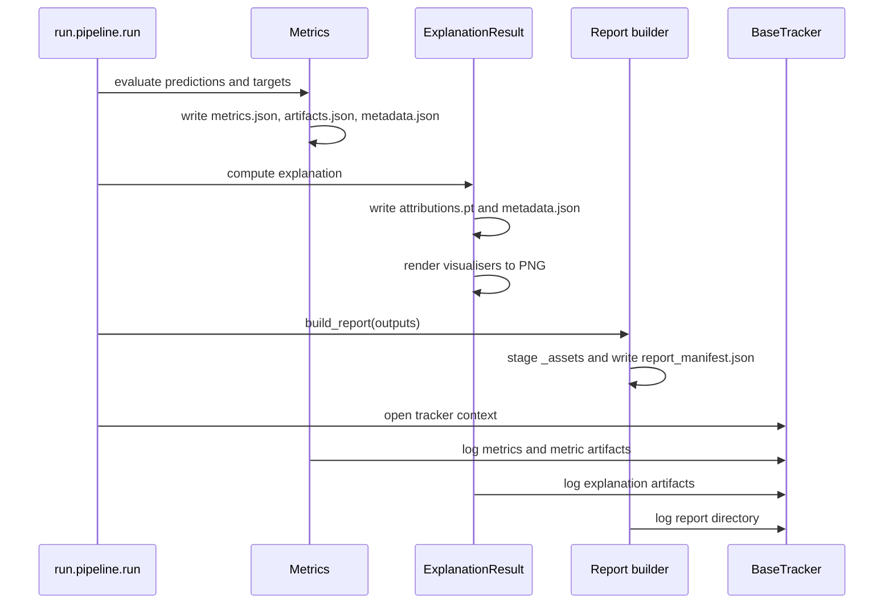

Every major RAITAP stage writes durable artifacts. That includes metrics JSON, transparency tensors, rendered images, report manifests, and optional tracked copies. Understanding that artifact flow is the easiest way to debug or extend the package.

## What This Concept Solves

Assessment pipelines often mix ephemeral in-memory objects with ad hoc file writes. RAITAP instead gives each module ownership of its own outputs. Metrics own `metrics/`, explainers own `transparency/<explainer>/`, and reporting owns `reports/`. Tracking backends then upload those same directories.

This concept depends on `/docs/explainers-and-semantics`, because explanation semantics decide whether a figure is local, cohort, or global. It also depends on `/docs/hydra-configuration`, because the Hydra run directory is the base path for all artifacts.

## How It Works Internally



`MetricsEvaluation` in `src/raitap/metrics/factory.py` persists scalar metrics and non-scalar artifacts separately. `ExplanationResult` in `src/raitap/transparency/results.py` persists `attributions.pt` and metadata, then returns `VisualisationResult` objects for each rendered PNG.

`build_report()` in `src/raitap/reporting/builder.py` then reads those outputs indirectly through the `RunOutputs` object. It groups metrics, global visualisations, cohort visualisations, and selected local samples into `ReportSection` and `ReportGroup` values. `PDFReporter.generate()` in `src/raitap/reporting/pdf_reporter.py` renders those sections into a PDF and `ReportManifest.write()` serializes a machine-readable manifest alongside it.

Tracking is the final layer. `BaseTracker.create_tracker()` in `src/raitap/tracking/base_tracker.py` resolves the configured backend, and `MLFlowTracker` in `src/raitap/tracking/mlflow_tracker.py` logs config, dataset metadata, metrics, transparency artifacts, and optional model artifacts.

## Basic Usage

If you only want local artifacts, disable tracking and leave reporting enabled:

```bash
uv run raitap hardware=cpu tracking._target_=null
```

After the run, inspect:

```text
outputs/<date>/<time>/
  metrics/
  transparency/
  reports/
```

## Advanced Usage

If you want tracked artifacts too, enable the MLflow preset:

```bash
uv run raitap hardware=cpu tracking=mlflow reporting=pdf
```

The `MLFlowTracker` will:

- call `log_config()` and persist the resolved config JSON
- call `log_dataset()` with `Data.describe()`
- call `log_metrics()` for scalar metric values
- upload `metrics/`, `transparency/`, and `reports/` artifact directories

<Callout type="warn">A report is built from rendered visualisations, not from raw attribution tensors alone. If an explainer has no compatible local or summary visualisers, the report may contain less content than you expect even though the explanation itself succeeded. The selection logic in `src/raitap/reporting/builder.py` only works with `VisualisationResult` and `MetricsEvaluation` outputs.</Callout>

<Accordions>
<Accordion title="Why tracking uploads directories instead of recomputing artifacts">
The tracker interface is intentionally generic. `ExplanationResult.log()`, `VisualisationResult.log()`, and `MetricsEvaluation.log()` know exactly which local files belong to each stage, so the tracker only needs artifact upload primitives such as `log_artifacts()` and `log_metrics()`. That keeps tracking backends simple and makes local runs the source of truth. The trade-off is that a corrupted local artifact directory also affects tracked runs, so the write-before-log order matters.

```python
with BaseTracker.create_tracker(cfg) as tracker:
    outputs.metrics.log(tracker)
```
</Accordion>
<Accordion title="Why reporting stages assets into a dedicated reports directory">
The report builder copies referenced images into `reports/_assets` instead of linking back to the original metric or transparency folders. That gives the report and its manifest a stable self-contained asset set that can be moved or uploaded later. It also lets merged reports reuse the same file-naming scheme without mutating original run outputs. The downside is some duplication on disk, but the resulting report directory is much easier to archive and inspect.

```python
report = build_report(cfg, outputs)
generation = create_report(cfg, report)
print(generation.report_path)
```
</Accordion>
</Accordions>

If you need to integrate RAITAP into a larger MLOps system, this artifact ownership model is the part to keep intact.
