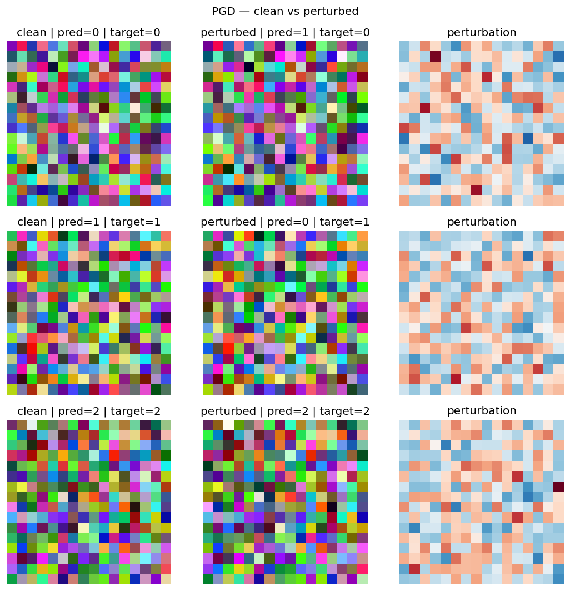
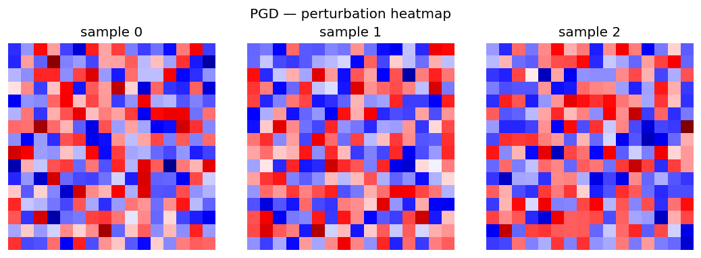
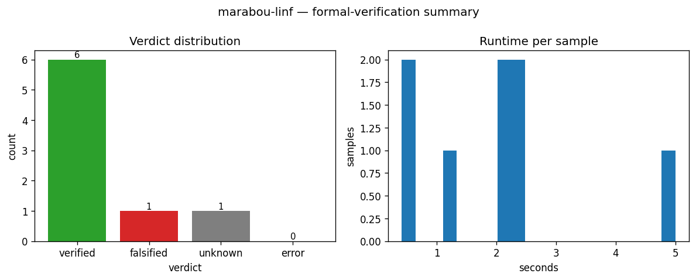
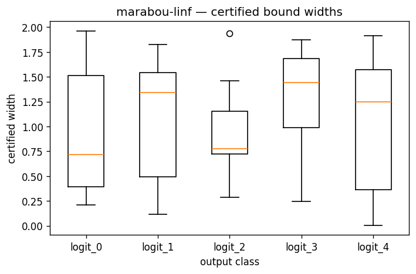
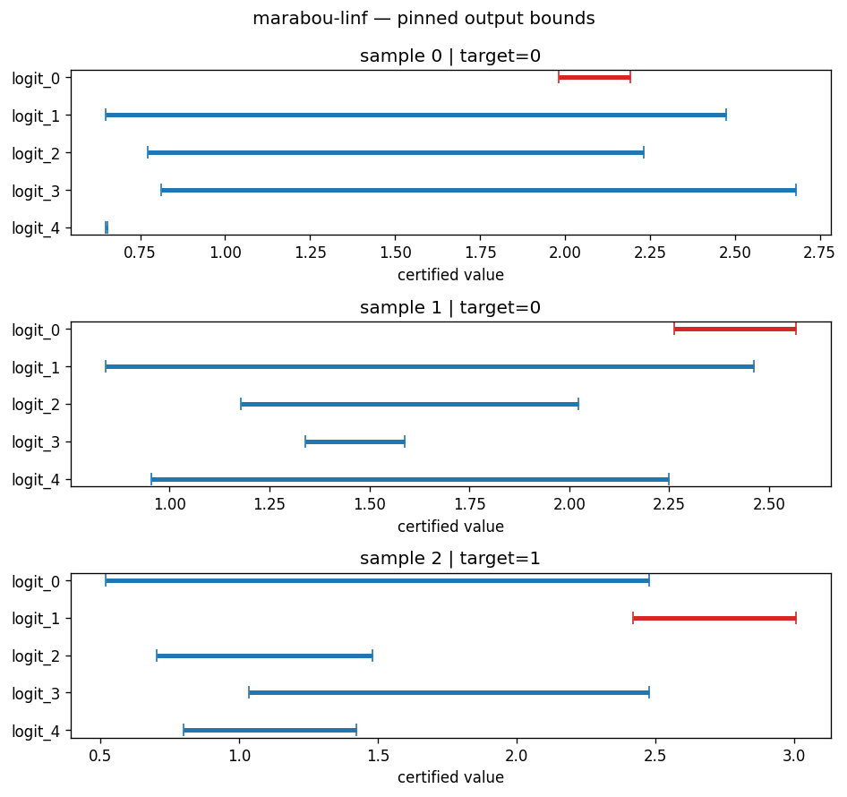
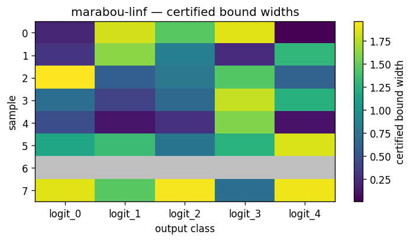
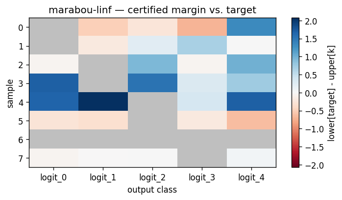

# Robustness Visualisers

Each visualiser renders one figure per call. All of them are declared per-assessor in YAML:

```yaml
robustness:
  marabou:
    _target_: "MarabouAssessor"
    visualisers:
      - _target_: "OutputBoundsCohortVisualiser"
      - _target_: "OutputBoundsMarginHeatmapVisualiser"
```

Visualisers declare which `MethodKind` they support; the factory rejects mismatches at YAML parse time.

## Empirical attack

### ImagePairVisualiser

Renders the first few samples as three side-by-side panels — clean input,
perturbed input, and a signed perturbation heatmap — so you can eyeball
whether the attack produced a visually plausible counter-example or just
noise. Use it as the default first-pass sanity check for any image-modality
attack run.

| Kwarg | Default | Meaning |
|---|---|---|
| `max_samples` | `4` | Maximum number of rows (samples) to render. |
| `cmap` | `"RdBu_r"` | Diverging colormap used for the signed perturbation panel. |
| `diff_scale` | `None` | Fixed symmetric vmin/vmax for the perturbation panel. `None` means auto-fit per-figure. |

Supports `MethodKind.EMPIRICAL_ATTACK`. Rejects non-image results
(`InputSpec.kind != IMAGE`).



### PerturbationHeatmapVisualiser

Per-sample diverging heatmap of the perturbation only. Useful when you do not
need the clean / perturbed comparison and want a denser grid focused on the
attack's spatial signature. The default channel reduction
(`signed_dominant`) keeps the signed value of the channel with the largest
absolute deviation, so red/blue regions track the *direction* of the attack
rather than collapsing to zero on cancelling channels.

| Kwarg | Default | Meaning |
|---|---|---|
| `max_samples` | `4` | Maximum number of samples to render. |
| `cmap` | `"seismic"` | Diverging colormap for the perturbation. |
| `aggregate_channels` | `"signed_dominant"` | Channel reduction: `signed_dominant`, `mean`, `mean_abs`, or `max_abs`. |

Supports `MethodKind.EMPIRICAL_ATTACK`. Rejects non-image results.



## Formal verification

### VerdictSummaryVisualiser

Two-panel summary of a verifier batch: a bar chart of per-verdict counts
(`VERIFIED` / `FALSIFIED` / `UNKNOWN` / `ERROR`) plus a histogram of
`runtime_per_sample`. Use it as the first thing you look at after a Marabou
run to see how the verifier performed before drilling into bound widths.

| Kwarg | Default | Meaning |
|---|---|---|
| `runtime_bins` | `20` | Histogram bin count for the runtime panel. |

Supports `MethodKind.FORMAL_VERIFICATION`.



### OutputBoundsCohortVisualiser

One boxplot per output class summarising the certified
`upper[i, k] - lower[i, k]` widths across the verified batch. Reach for it
when you want a single figure that says "class `k`'s certified region is
tight for most samples but has a long tail at logit 3".

| Kwarg | Default | Meaning |
|---|---|---|
| `whis` | `1.5` | Matplotlib whisker length (multiple of IQR). |
| `show_outliers` | `True` | Whether to render flier points beyond the whiskers. |

Supports `MethodKind.FORMAL_VERIFICATION`. Renders a placeholder figure when
`result.output_bounds is None` or every row is NaN.



### OutputBoundsPinnedVisualiser

One sub-plot per pinned (or first-finite) sample, showing the certified
`[lower_k, upper_k]` interval for each output class with the target class
highlighted. Use it to examine specific samples by index — e.g. "what does
the bound for sample 17 look like?"

| Kwarg | Default | Meaning |
|---|---|---|
| `max_samples` | `4` | Maximum number of samples when `sample_indices` is not provided. |
| `target_color` | `"#d62728"` | Bar colour for the target class. |
| `bar_color` | `"#1f77b4"` | Bar colour for non-target classes. |
| `sample_indices` | `None` | Optional explicit list of row indices to pin. |

Supports `MethodKind.FORMAL_VERIFICATION`. Falls back to a placeholder when
bounds are absent.



### OutputBoundsWidthHeatmapVisualiser

A samples-by-classes heatmap whose cell value is the certified width
`upper - lower`. NaN rows (FALSIFIED / UNKNOWN / ERROR) render as grey
masked cells, so the figure also doubles as a coverage map. Pick this over
the cohort boxplot when batch size is small enough that per-sample
visibility is more useful than per-class aggregate stats.

| Kwarg | Default | Meaning |
|---|---|---|
| `cmap` | `"viridis"` | Sequential colormap for widths. |
| `max_samples` | `None` | Truncate to the first N rows. `None` renders every row. |
| `figsize` | `None` | Manual override; `None` picks an auto size from sample / class counts. |

Supports `MethodKind.FORMAL_VERIFICATION`.



### OutputBoundsMarginHeatmapVisualiser

A samples-by-classes heatmap of the per-class margin against the target:
`margin[i, k] = lower[i, target_i] - upper[i, k]`. Positive cells (blue)
mean the target class is provably above class `k` everywhere in the
certified region; negative cells (red) mean class `k` could overtake the
target. The target column is masked grey. Use it for "is this batch
*robustly* classified, or merely *verified-with-room-to-flip*?"

| Kwarg | Default | Meaning |
|---|---|---|
| `cmap` | `"RdBu"` | Diverging colormap. |
| `max_samples` | `None` | Truncate to the first N rows. `None` renders every row. |
| `figsize` | `None` | Manual override; `None` picks an auto size. |

Supports `MethodKind.FORMAL_VERIFICATION`. Falls back to a placeholder when
`result.targets` is missing or shaped wrong.


