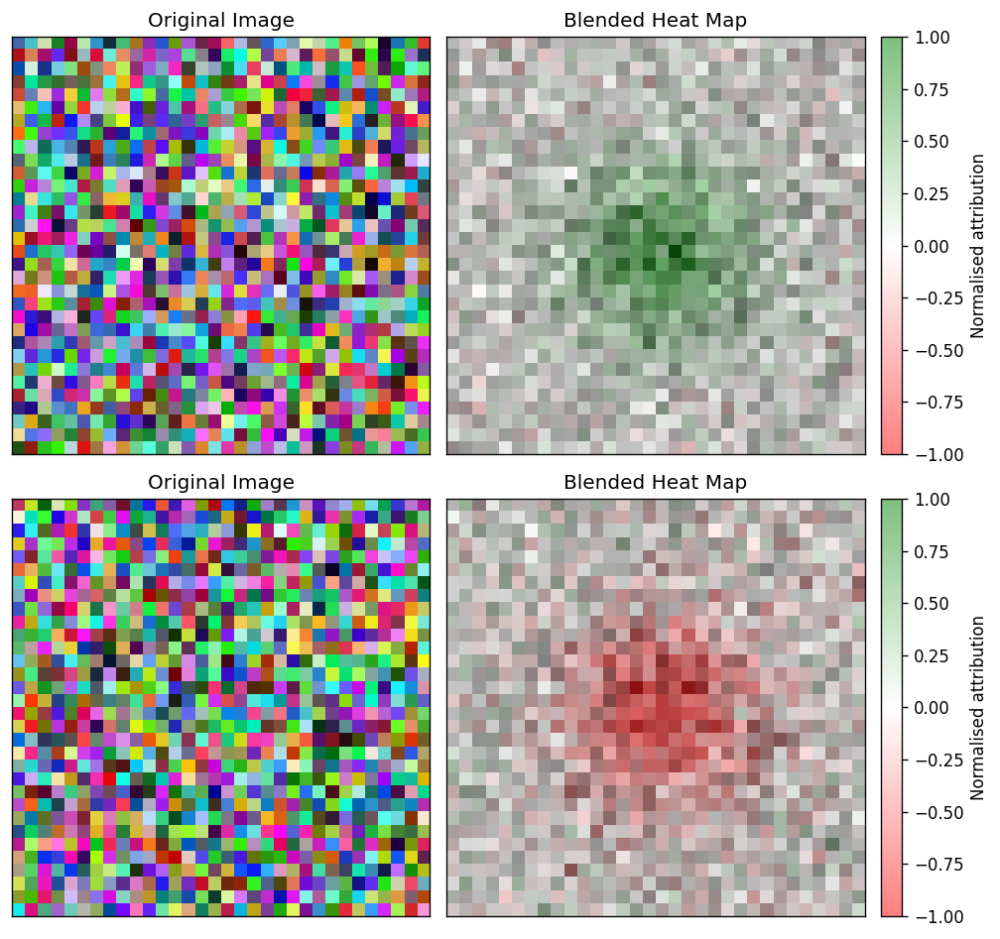
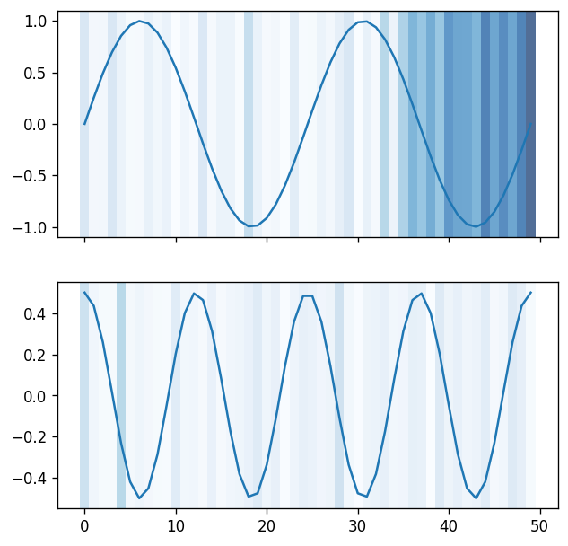
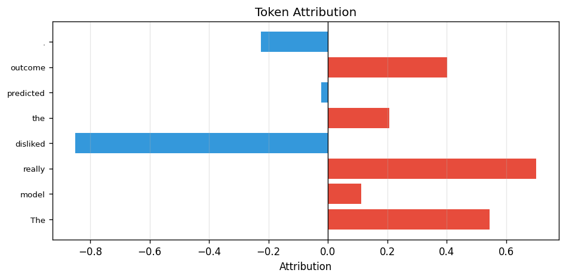
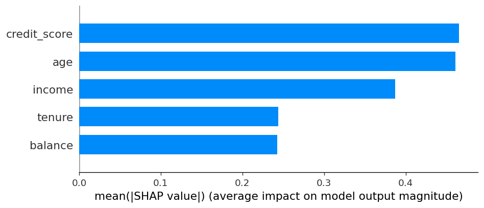
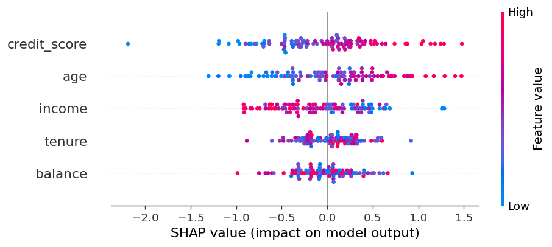
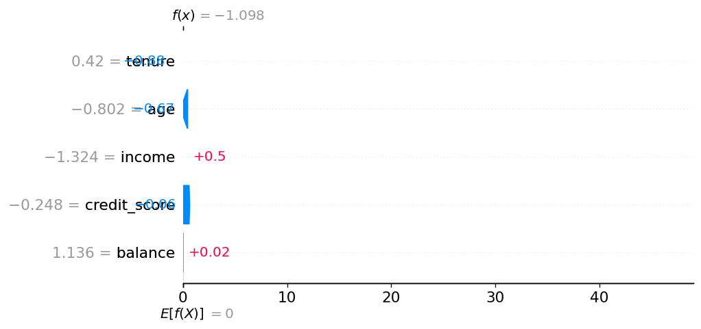
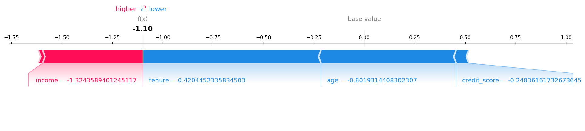
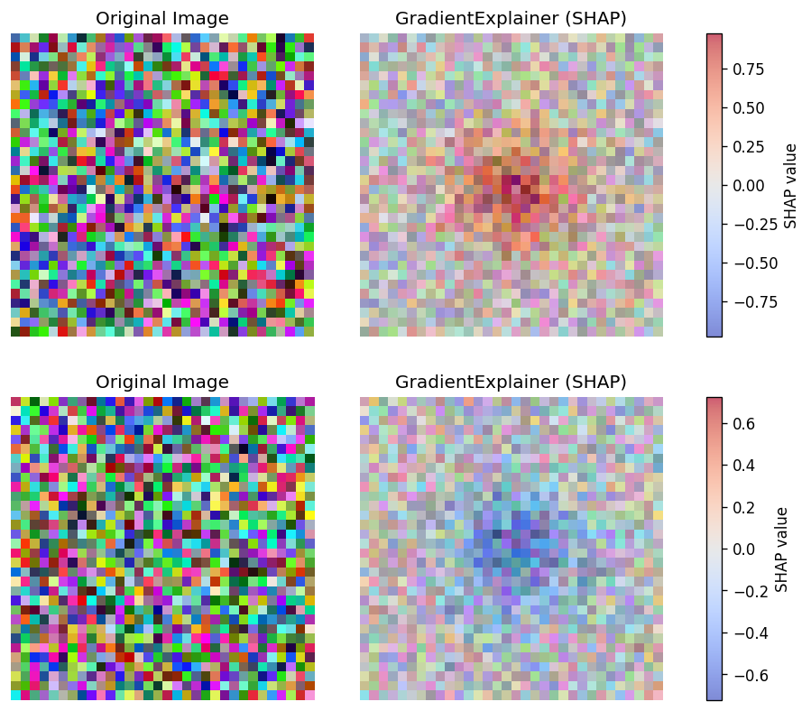
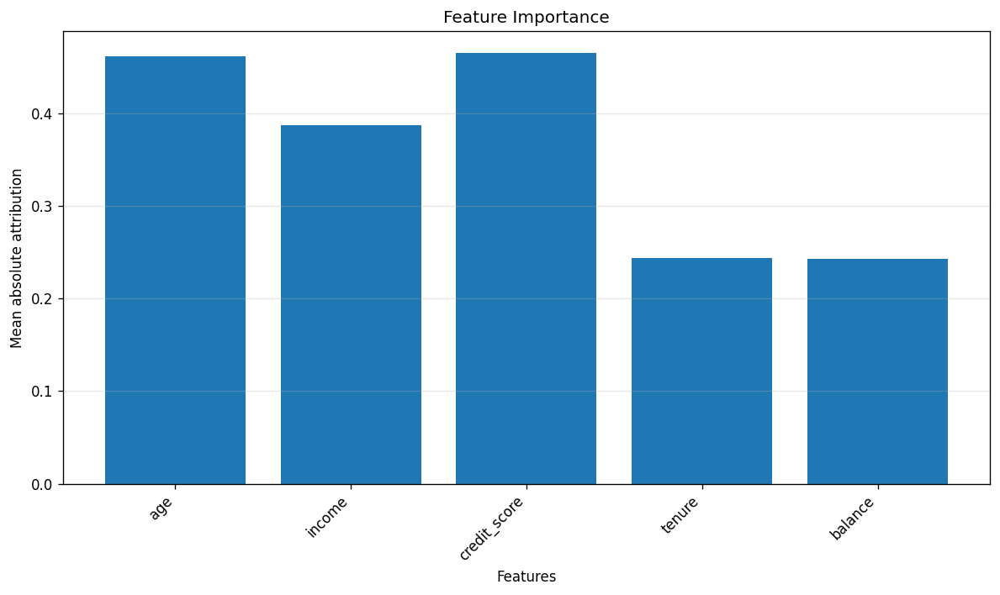

# Visualisers

Each visualiser renders one figure per call. All of them are declared per-explainer in YAML:

```{config-tabs}
:yaml:
transparency:
  captum_ig:
    _target_: "CaptumExplainer"
    algorithm: "IntegratedGradients"
    visualisers:
      - _target_: "CaptumImageVisualiser"
      - _target_: "TabularBarChartVisualiser"

:python:
from raitap.transparency import captum, captum_image, tabular_bar_chart

transparency = {
    "captum_ig": captum(
        algorithm="IntegratedGradients",
        visualisers=[captum_image(), tabular_bar_chart()],
    ),
}
```

Visualisers declare which `ExplanationScope`, output space, and method families they support;
the factory rejects mismatches at YAML parse time. See
{doc}`frameworks-and-libraries` for the at-a-glance compatibility table and
{doc}`../../contributor/transparency` for the underlying contract.

## Captum

### CaptumImageVisualiser

Side-by-side panels — original image on the left, attribution overlay on the
right — for each sample in the batch. Use it as the default first-pass figure
whenever the explainer produces pixel-level or spatial-map attributions on
image inputs.

Wraps `captum.attr.visualization.visualize_image_attr`.

| Kwarg | Default | Meaning |
|---|---|---|
| `method` | `"blended_heat_map"` | Captum render mode: `blended_heat_map`, `heat_map`, `original_image`, `masked_image`, `alpha_scaling`. |
| `sign` | `"all"` | Which contributions to show: `all`, `positive`, `negative`, `absolute_value`. |
| `show_colorbar` | `True` | Whether to add a colorbar next to the attribution panel. |
| `title` | `None` | Optional attribution panel title forwarded to Captum. |
| `include_original_image` | `True` | Render the original image next to the attribution panel when `inputs` are available. |

Scope: `LOCAL`. Output spaces: `INPUT_FEATURES`, `IMAGE_SPATIAL_MAP`.
Method families: `GRADIENT`, `PERTURBATION`, `SHAPLEY`, `CAM`,
`MODEL_AGNOSTIC`, `SURROGATE`. Requires explicit image input metadata
(`InputKind.IMAGE`) and an NCHW-compatible attribution shape; rejects tabular,
token, and time-series layouts.

Layer-based methods (`LayerGradCam`, `LayerActivation`, …) emit attribution
maps at the chosen layer's spatial resolution (e.g. 7×7 for ResNet-18 `layer4`
with 224×224 inputs). When `inputs` are provided, the visualiser bilinearly
upsamples such maps to the original image size before rendering so the overlay
aligns with the input extent — applied for every `method` except
`original_image` (which ignores the attribution). The map still snaps to the
layer's cell grid — this is intrinsic to Grad-CAM and not a visualiser
artefact. For tighter localisation, use a shallower layer (e.g. `layer3` →
14×14) or a pixel-space method (`Saliency`, `IntegratedGradients`,
`GuidedGradCam`).



### CaptumTimeSeriesVisualiser

Overlay of per-channel attribution magnitudes on top of the raw time-series
signal. Pick this when the explainer ran on `(T, C)` channels-last inputs and
you want to see *when* in the sequence the model focused.

Wraps `captum.attr.visualization.visualize_timeseries_attr`.

| Kwarg | Default | Meaning |
|---|---|---|
| `method` | `"overlay_individual"` | One of `overlay_individual`, `overlay_combined`, `colored_graph`. |
| `sign` | `"absolute_value"` | One of `positive`, `negative`, `absolute_value`, `all`. |

Scope: `LOCAL`. Output space: `INPUT_FEATURES`. Requires
`InputKind.TIME_SERIES` metadata and `(B, T, C)` or `(T, C)` attribution
layouts. The `inputs` argument (the original time series) is mandatory —
attributions alone are not enough to render the overlay.



### CaptumTextVisualiser

Horizontal bar chart of per-token attribution scores. Positive contributions
render in warm red, negative in cool blue, so you can read off which tokens
pushed the prediction in which direction at a glance.

Wraps a lightweight Matplotlib renderer (Captum's native text visualiser emits
HTML rather than a Matplotlib figure).

| Kwarg | Default | Meaning |
|---|---|---|
| `token_labels` | `None` | Per-token strings used as y-axis labels. Falls back to `tok_0 … tok_N` when omitted. |

Scope: `LOCAL`. Output space: `TOKEN_SEQUENCE`. Requires text input metadata
and a 1-D token attribution tensor with the `TOKENS` / `TOKEN_SEQUENCE`
layout.



## SHAP

### ShapBarVisualiser

Mean-absolute-attribution bar chart across the cohort, one bar per input
feature. Use it as the headline "what matters on average?" figure for any
tabular or interpretable-features explanation.

Wraps `shap.summary_plot(plot_type="bar")`.

| Kwarg | Default | Meaning |
|---|---|---|
| `feature_names` | `None` | Optional list of feature labels. Falls back to SHAP's `f0 … fN` defaults. |
| `max_display` | `20` | Maximum number of features to render. |

Scope: `LOCAL` (consumes local attributions). Produces a cohort visual
summary so reporting places the figure under cohort explanations. Output
spaces: `INPUT_FEATURES`, `INTERPRETABLE_FEATURES`. Method family: `SHAPLEY`.
Requires `(B, F)` tabular or interpretable attributions.



### ShapBeeswarmVisualiser

SHAP beeswarm: one dot per sample per feature, coloured by the feature value,
positioned by the SHAP score. Reach for it when the bar chart hides
distributional information you care about (e.g. "income matters, but only
when it is high").

Wraps `shap.summary_plot()` (default `plot_type="dot"`).

| Kwarg | Default | Meaning |
|---|---|---|
| `feature_names` | `None` | Optional list of feature labels. |
| `max_display` | `20` | Maximum number of features to render. |

Scope: `LOCAL` consumed, cohort visual summary produced. Output spaces:
`INPUT_FEATURES`, `INTERPRETABLE_FEATURES`. Method family: `SHAPLEY`.
Requires `(B, F)` tabular or interpretable attributions; passing `inputs`
unlocks the colour-by-feature-value channel.



### ShapWaterfallVisualiser

Per-sample waterfall chart: starts at the baseline `expected_value` and walks
through each feature's contribution to reach the model output. Pick a single
sample with `sample_index` when you want to explain a specific prediction
end-to-end.

Wraps `shap.plots.waterfall`.

| Kwarg | Default | Meaning |
|---|---|---|
| `feature_names` | `None` | Optional list of feature labels. |
| `expected_value` | `0.0` | Model baseline (`explainer.expected_value` in SHAP). |
| `sample_index` | `0` | Which row of the batch to render. |
| `max_display` | `10` | Maximum number of features to show before grouping the rest. |

Scope: `LOCAL`. Requires `(B, F)` tabular or interpretable attributions.



### ShapForceVisualiser

Per-sample force plot showing positive (red) and negative (blue) feature
pushes around the baseline. Compact alternative to the waterfall when you
need many local explanations side by side rather than one detailed
breakdown.

Wraps `shap.plots.force(matplotlib=True)`.

| Kwarg | Default | Meaning |
|---|---|---|
| `feature_names` | `None` | Optional list of feature labels. |
| `expected_value` | `0.0` | Model baseline / SHAP base value. |
| `sample_index` | `0` | Which row of the batch to render. |

Scope: `LOCAL`. Requires `(B, F)` tabular or interpretable attributions. Saved
as a PNG via Matplotlib (RAITAP does not use SHAP's HTML force-plot backend).



### ShapImageVisualiser

Paired-panel renderer for pixel-level SHAP values: original image on the
left, channel-summed heatmap overlay on the right. Restricted to
`GradientExplainer` and `DeepExplainer` — the only SHAP explainers that
produce meaningful per-pixel scores.

Implemented as a custom RAITAP Matplotlib renderer (SHAP's native
`shap.image_plot` is not used; this keeps the layout consistent with the
other RAITAP image visualisers and adds sample-aware titles and colorbar
control).

| Kwarg | Default | Meaning |
|---|---|---|
| `max_samples` | `4` | Maximum number of images displayed side by side. |
| `title` | `None` | Optional attribution-panel title (falls back to algorithm name). |
| `include_original_image` | `True` | Render the original image next to the heatmap. |
| `show_colorbar` | `True` | Add a SHAP colorbar in the paired layout. |
| `cmap` | `"coolwarm"` | Matplotlib colormap for the heatmap overlay. |
| `overlay_alpha` | `0.65` | Alpha for the SHAP heatmap overlay. |

Scope: `LOCAL`. Output space: `INPUT_FEATURES`. Method family: `GRADIENT`.
Requires explicit image input metadata and `(B, C, H, W)` attributions; will
refuse explanations from non-pixel SHAP explainers such as `KernelExplainer`
or `TreeExplainer`.



## Generic

### TabularBarChartVisualiser

Framework-agnostic mean-absolute-attribution bar chart for tabular features.
Use it when the explainer is Captum (or anything else) rather than SHAP and
you still want the same "what matters on average?" cohort summary.

Wraps a small Matplotlib renderer (no third-party plotting dependency).

| Kwarg | Default | Meaning |
|---|---|---|
| `feature_names` | `None` | List of feature names for x-axis labels. |

Scope: `LOCAL` consumed, cohort visual summary produced. Output spaces:
`INPUT_FEATURES`, `INTERPRETABLE_FEATURES`. All method families are
accepted. Requires `(B, F)` tabular attributions; rejects image, text, and
time-series modalities.



## Detection

### DetectionImageVisualiser

Renders one figure per detected box for any backend whose `task_kind == detection`
(torchvision Faster R-CNN / RetinaNet / SSD). Each figure shows the original
image with the reference bounding box outlined and the per-pixel attribution
heatmap overlaid; the title carries the label name (falls back to `class N`
when no name is available) and the detection score plus the box's
`display/raw` index pair for provenance.

Compatible with all attribution method families that produce per-pixel maps
(gradient, perturbation, shapley, cam, model-agnostic, surrogate).

```yaml
transparency:
  my_ig_explainer:
    _target_: CaptumExplainer
    algorithm: IntegratedGradients
    call:
      target: 0                  # required — wrapper exposes one scalar channel
    raitap:
      detection:
        score_threshold: 0.5     # default; drop detections below this
        max_boxes: 5             # default; cap K per sample
        iou_threshold: 0.5       # default; used by reference_match target
    visualisers:
      - _target_: DetectionImageVisualiser
```

The pipeline emits one `ExplanationResult` per detected box (top-K after
threshold filtering), each carrying a `DetectionBox` with the reference
xyxy / score / label. Results from the same sample share
`original_sample_index` so reporting groups them visually via the sample-id
chip.

Scope: `LOCAL`. Output space: `DETECTION_BOXES`. Supported task: `detection`.
Requires `VisualisationContext.detection_box` to be set (populated
automatically by the detection explain phase).
